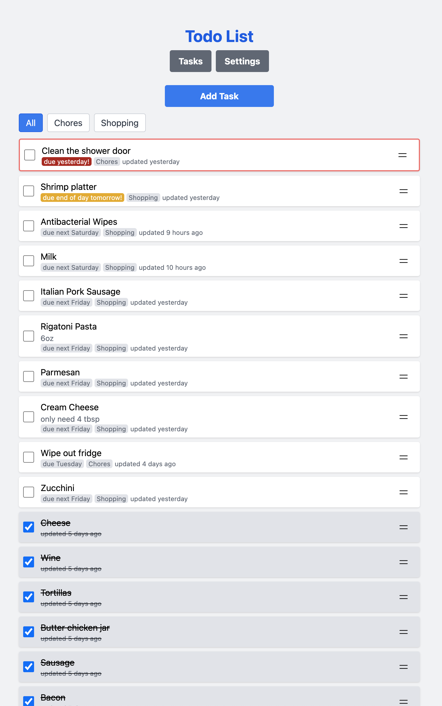

# Todo List Application

<p align="center">
  
</p>

## Features

- Create, edit, and delete tasks
- Support for recurring tasks (daily, weekly, monthly)
- Categorize tasks for better organization
- TV mode display option
- Priority levels (high, normal, low)
- Due date management with visual indicators

## Technology Stack

- Backend: PHP 8.2
- Database: SQLite3
- HTMX for dynamic updates
- AlpineJS for reactive components
- TailwindCSS for styling

## Running Locally

1. Clone the repository
2. Make sure you have PHP 8.2+ installed
3. Run the development server: `./start.sh`
4. Visit `http://localhost:8081` in your browser

## Deploying to a server

1. Clone this repo to ./todo/
2. Add this project to your docker-compose file:

```yaml
todo:
  image: sifuen/todo
  restart: always
  build: ./todo/
  volumes:
    - ./todo/data:/var/www/data
```

You can either expose port 8080 there or have a reverse-proxy send traffic to
`todo:8080`.

## Project Structure

- `/src/web/` - Frontend PHP files and assets
- `/src/lib/` - Backend library code and utilities
- `/src/db/` - Database migrations and seed data
- `/data/` - SQLite database storage (auto-created)
